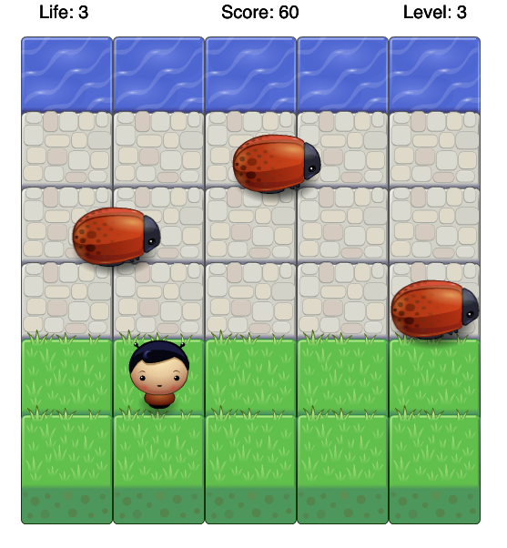

# Classic Arcade Game Clone Project

## Table of Contents

- [Instructions](#instructions)
- [Installation](#installation)

## Instructions
This is a project of Front-End Web developer Nanodegree by Udacity.
I made this arcade game following Udacity's requirements [rubric](https://review.udacity.com/#!/rubrics/15/view) and using provided code and images.

Play from [here](https://misakimichy.github.io/arcade-game/)


- Use your arrow keys to move.
- Every time you reach the top of screen, the game difficulty increases.
- If the player hits an enemy, player loose points and player will automatically back to the start position.
- A star will appear from decent level and you can earn extra points.
- A heart will appear in a decent condition and you can recover player life.


## Installation
1. Please use the following command to download
```
git clone https://github.com/misakimichy/arcade-game.git
```

2. Open index.html in your browser and you're ready to play.

Or you can download zip file to your hard drive.
- Click the green button "Clone or download" above then choose "Download ZIP".
- Open the folder `arcade-game-master`.
- Open `index.html` in your browser.
